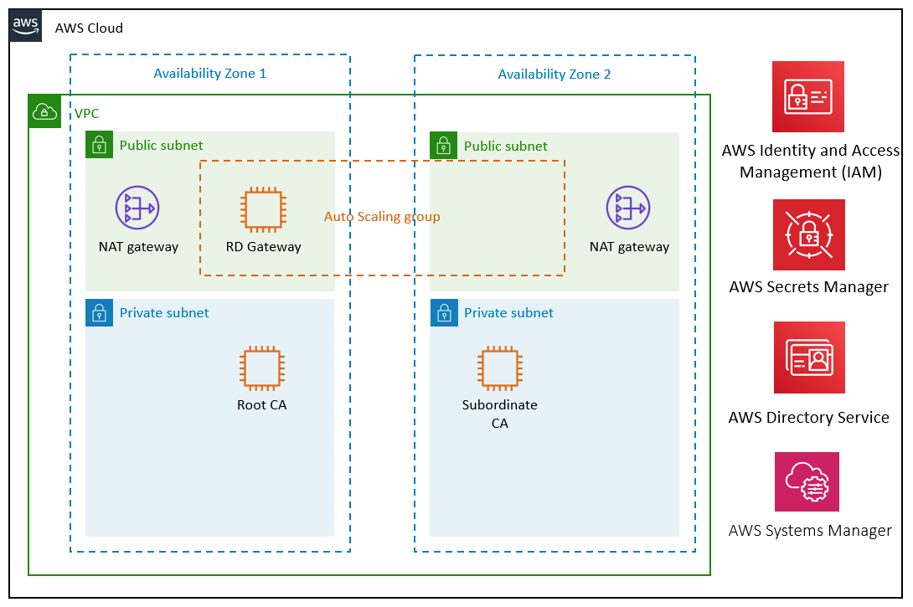
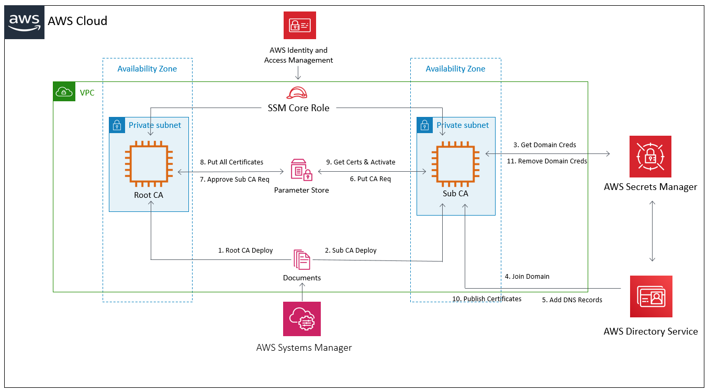

Deploying this Quick Start for a new virtual private cloud (VPC) with default parameters builds the following {partner-product-short-name} environment in the AWS Cloud.

:xrefstyle: short
[#architecture1]
.Quick Start architecture for {partner-product-short-name} on AWS

As shown in <<architecture1>>, the Quick Start sets up the following:

* An architecture that spans two Availability Zones.*
* A VPC configured with public and private subnets, according to AWS best practices, to provide you with your own virtual network on AWS.*

* In the public subnets:
** Managed network address translation (NAT) gateways to allow outbound internet access for resources in the private subnets.*
** A Remote Desktop Gateway (RD Gateway) instance in an Auto Scaling group to allow inbound Remote Desktop Protocol (RDP) access to EC2 instances in public and private subnets.*

* In the private subnets:
** In Availability Zone 1, an EC2 instance running Windows to serve as an offline root CA.
** In Availability Zone 2, an EC2 instance running Windows to serve as a subordinate CA.
* AWS Directory Service, which helps deploy an Active Directory Certificate Services (AD CS) environment.*
* AWS Secrets Manager to store credentials.
* AWS Systems Manager (formerly known as Amazon Simple Systems Manager, or SSM) to automate the CA deployment process and store the generated certificates.
* AWS Identity and Access Management (IAM) to enable the EC2 instances and Systems Manager automation documents to perform their tasks.

[.small]#* The template that deploys the Quick Start into an existing VPC skips the components marked by asterisks and prompts you for your existing VPC configuration.#

== The AD CS deployment process

This Quick Start deploys an AD CS environment, which includes an offline root CA and an online subordinate CA. The AWS Systems Manager automation document created by this Quick Start automates the steps shown in the following diagram. When the process is complete, the root CA has generated a domain root certificate and is powered off, and the subordinate CA is available to sign certificate requests for the domain.

[#architecture2]
.The AD CS deployment process

Deploying this Quick Start, as shown in <<architecture2>>, automates the following steps: 

1.  The root CA is installed and configured.
2.  The subordinate CA is installed and configured.
3.  Domain credentials are obtained from Secrets Manager.
4.  The Active Directory domain is joined.
5.  The Domain Name System (DNS) records for the root CA and subordinate CA are added.
6.  The subordinate CA puts a certificate-signing request into Parameter Store.
7.  The root CA gets a CA request from Parameter Store and approves it.
8.  The root CA puts all certificates and certificate-revocation lists into Parameter Store.
9.  The subordinate CA gets all certificates from Parameter Store.
10. (Not shown) The subordinate CA uses `dspublish` to install the certificate and activate AD CS.
11. (Not shown) The subordinate CA removes the domain credentials from Secrets Manager.
